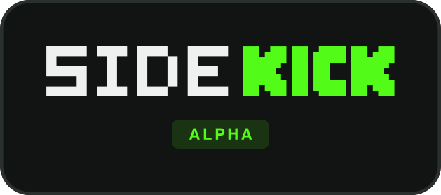

  

**A desktop client for watching Kick: its own player, live chat, follows and notifications.**

 

  

 

 

Made by a viewer, for viewers. By [AnakUn](https://kick.com/anakun).

 

## Alpha

SideKick is in **alpha**. It is used every day and improves quickly, but expect rough edges, and things can change between versions. Updates arrive on their own (see [Updates](#updates)), so problems get fixed without you doing anything.

## What it does

- **Its own player** for streams, up to 1080p60, with low latency, a floating mini player and an audio-only mode
- **Live chat** with 7TV and 67TV emotes, mentions and highlights, and moderation tools
- **Follows that stay in sync** with your Kick account, a live sidebar, and a notification when someone you follow goes live
- **Favourites** you can arrange yourself, a Windows tray icon and keyboard shortcuts
- **Automatic updates** that never restart the app while you are watching a stream

## Install

1. Download `SideKick_<version>_Setup.exe` from the [latest release](https://github.com/AnakUn69/sidekick-releases/releases/latest).
2. Run it. Windows may show a blue *"Windows protected your PC"* screen, because the installer is not signed yet. Choose **More info**, then **Run anyway**.
3. Pick your options (desktop shortcut, automatic updates) and press **Install**.
4. Open SideKick and press **Sign in**. A small window asks you to log in to Kick and allow the app.

It installs for your user only, so no administrator rights are needed. Windows 10 and 11 are supported.

## Updates

SideKick checks this page for new versions and installs them by itself, but never in the middle of a stream. You can change that any time in **Settings → Updates**: *Automatic*, *Ask me* or *Off*. The same page lists every version with what changed.

Every installer is signed, and the app checks the signature before it installs anything.

## Uninstall

Windows **Settings → Apps → SideKick**, or run the installer again and choose **Uninstall**. You can also remove your saved settings there.

## Good to know

- SideKick is an independent project and is **not affiliated with Kick**.
- This repository only holds the downloads. The versions and what changed in each of them are under [Releases](https://github.com/AnakUn69/sidekick-releases/releases).
- Found a bug or have an idea? [Open an issue](https://github.com/AnakUn69/sidekick-releases/issues). In SideKick, **Settings → About → Logs and diagnostics** can save a report you can attach.

 

SideKick is not endorsed by or affiliated with Kick.

